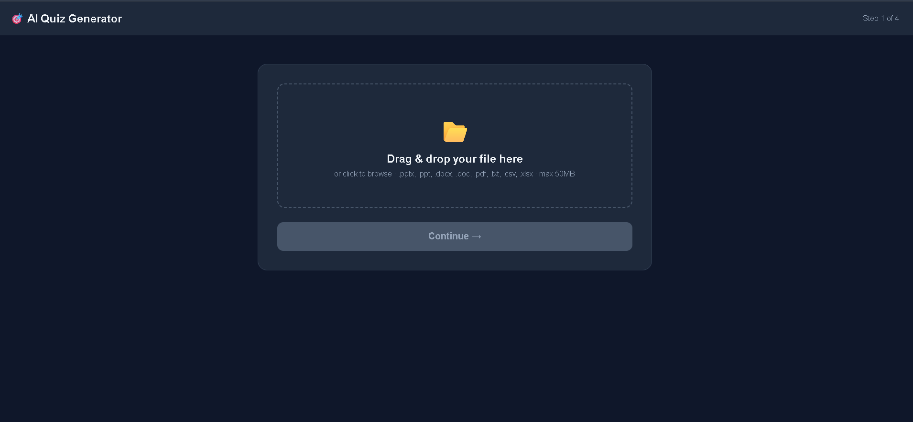
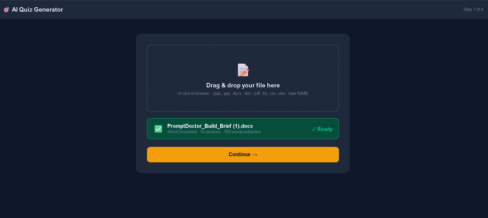
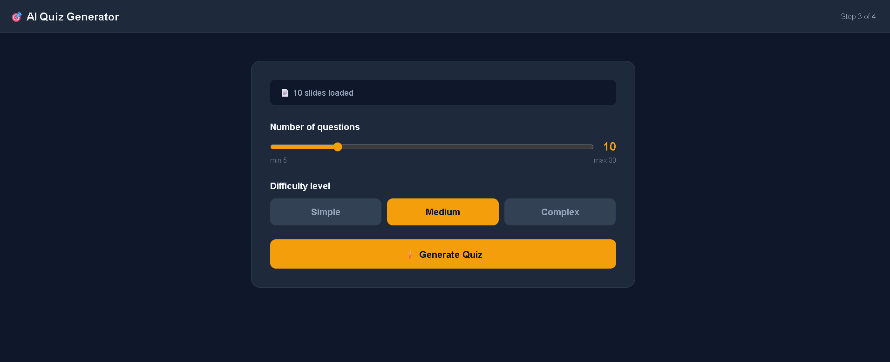
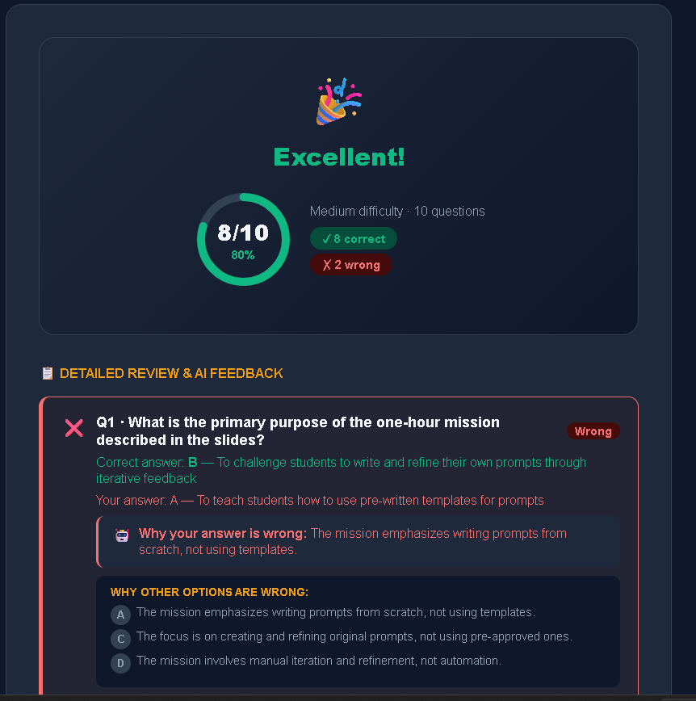
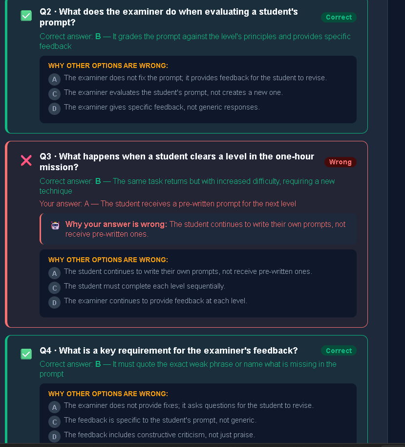
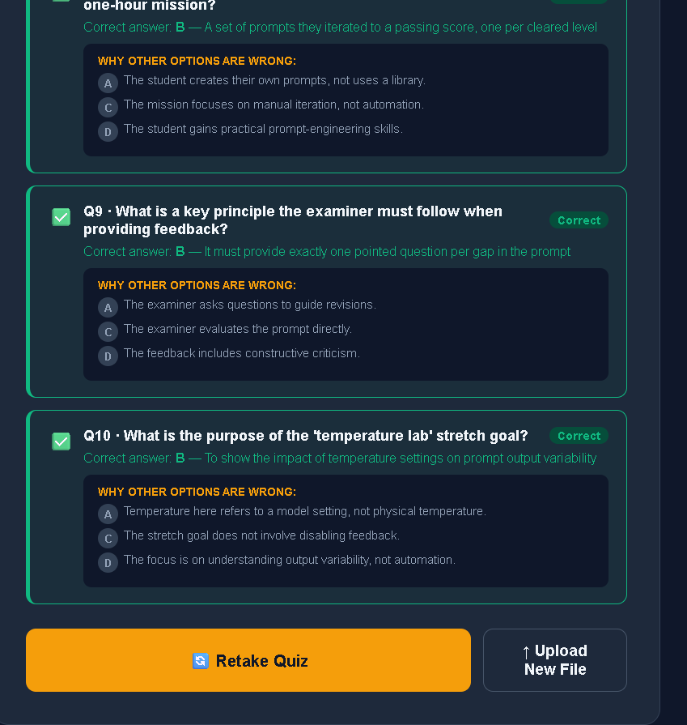

🚀 QuizBuilderAI
🎯 Project Overview

QuizBuilderAI is a full-stack AI-powered quiz generation platform that allows users to create and attempt interactive quizzes.
Users can select topic, difficulty, and number of questions, and the system generates quizzes with instant scoring and result analysis.

The project focuses on building an intelligent, interactive, and responsive quiz experience using modern web technologies.

✨ Features
🧠 AI-based quiz generation system
🎯 Custom quiz settings (topic, difficulty, number of questions)
📊 Instant scoring and result calculation
🏆 Detailed result summary
💻 Responsive and user-friendly UI
📁 Clean frontend + backend architecture
⚙️ Tech Stack
Frontend: React (Vite)
Backend: Flask (Python)
Styling: CSS
API: REST-based backend
📸 Project Screenshots (Step-by-Step Flow)
1️⃣ Home Page

  

2️⃣ File Upload Page

  

3️⃣ Quiz Settings Page

  

4️⃣ Quiz Interface

  

5️⃣ Result Page 1

  

6️⃣ Result Page 2

  

7️⃣ Result Page 3

  

🚀 How to Run
Backend
cd backend
pip install -r requirements.txt
python app.py
Frontend
cd frontend
npm install
npm run dev
📂 Project Structure
quiz_platform/
├── backend/
├── frontend/
├── outputs/
│   ├── home.png
│   ├── file_uploaded.png
│   ├── quiz-settings.png
│   ├── quiz.png
│   ├── output1.png
│   ├── output2.png
│   ├── output3.png
├── README.md
🔮 Future Improvements
🧠 AI explanation for answers
📱 Mobile-friendly UI
🌐 Deployment (Vercel / Render / Netlify)
👤 User authentication system
🏆 Leaderboard system
👩‍💻 Author

K. Supriya
